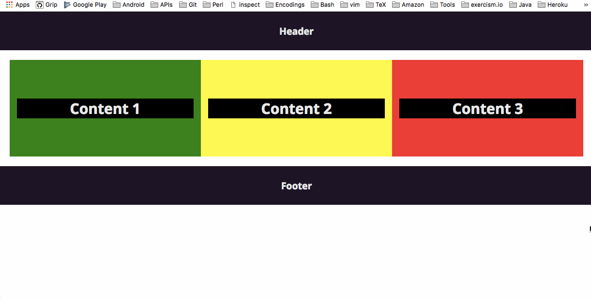

# Media Query Screen Width

[Check it out](https://weibeld.github.io/webdesign-media-query-width/)

A simple example how to create a responsive page layout by making **media queries** for the screen width.

## Summary

### Breakpoints

The example defines two screen width breakpoints resulting in three conditions that the page can be in:

1. **Phone:** screen width < 600 px
2. **Tablet:** screen width >= 600 px and < 768 px
3. **Desktop:** screen width > 768 px

The three content containers in the example are arranged in different ways for each screen width condition.

***

### Media queries

~~~css
@media only screen and (min-width: 600px) {
  /* CSS rules */
}
~~~

The above example includes the encapsulated block of CSS rules only if a certain condition is met. In this case, the condition is that the screen width is at least 600 pixels.

***

### Overwriting property values

We want the width of a certain element to be, for example, 100% in condition 1 (phone), 50% in condition 2 (tablet), and 33.33% in condition 3 (desktop).

We can do this by assigning three classes to this element:

~~~html

~~~

Then, in the CSS, we can assign a width of 100% unconditionally (default case), 50% if the screen width is 600 pixels or more, and 33,33% if the screen width is 768 pixels or more:

~~~css
.phone-100 { width: 100%; }

@media only screen and (min-width: 600px) {
  .tablet-50 { width: 50%; }
}

@media only screen and (min-width: 768px) {
  .desktop-33 { width: 33.33%; }
}
~~~

Now, when the screen width is less than 600 pixels, the classes `tablet-50` and `desktop-33` are not defined at all. So, the `
` element gets a width of 100% from the `phone-100` class.

When the screen width is 600 pixels or more, then the `tablet-50` class is included in the CSS. Since the `tablet-50` class is defined *after* the `phone-100` class, the width value of the `tablet-50` class overwrites the width value of the `phone-100` class. So, the `
` element gets a width value of 50% in this case.

When the screen width is 768 pixels or more, then `desktop-33` class is included as well in the CSS. Since `desktop-33` is defined *after* `tablet-50` and `phone-100`, it is the value of 33.33% that gets assigned to the `
` element.

Note that the **order in which the rules are defined matters**. If, for example, the class `phone-100` would be defined after `tablet-50` and `desktop-100` in the file, then these two classes couldn't overwrite the width value of the former class, but in turn `phone-100` would always overwrite `tablet-50` and `desktop-100`, and so the width of the `
` element would always be 100%.

On the other hand, the **order in which the classes are declared in the class attribute does not matter**. For example, the following two declarations have the same behaviour:

~~~html

~~~

~~~html

~~~
